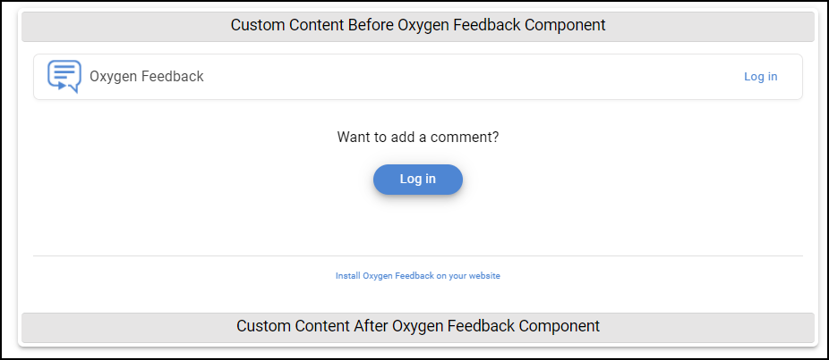

# Custom Content After Search Template

This is a sample publishing template that contributes custom HTML content before and after the Oxygen Feedback component in each topic page.



It uses an 
[XSLT Extension](https://www.oxygenxml.com/doc/versions/22.0/ug-webhelp-responsive/topics/whr-responsive-override-xslt-dita-xslt-import.html) File to customize the placeholder that is used to insert the Oxygen Feedbacl installation fragment. 

The XSLT extension loads each
[HTML Fragment](https://www.oxygenxml.com/doc/versions/22.0/ug-webhelp-responsive/topics/wh-add-custom-html.html#wh-add-custom-html__the_xml_file) that needs to be inserted in the output page from an associated XML file (`before-feedback-fragment.xml` , `after-feedback-fragment.xml`)  using custom transformation parameters (`custom.webhelp.before.feedback.fragment`, `custom.webhelp.before.feedback.fragment`) defined in the 
[Publishing Template's Descriptor File](https://www.oxygenxml.com/doc/versions/22.0/ug-webhelp-responsive/topics/whr_publishing_template_contents.html#ariaid-title2) (\*.opt).

The XSLT extension:
```
<?xml version="1.0" encoding="UTF-8"?>
<xsl:stylesheet xmlns:xsl="http://www.w3.org/1999/XSL/Transform"
    xmlns:xs="http://www.w3.org/2001/XMLSchema"
    xmlns:whc="http://www.oxygenxml.com/webhelp/components"
    xmlns:oxyf="http://www.oxygenxml.com/functions"
    exclude-result-prefixes="xs"
    version="2.0">
    
    <xsl:template match="whc:include_html[@href='${webhelp.fragment.feedback}']" mode="copy_template">
        <xsl:param name="template_base_uri" tunnel="yes"/>
        <xsl:param name="i18n_context" tunnel="yes" as="element()*"/>
        
        <div class="feedback-fragment-container">
            <!-- Output the HTML Fragment -->
            <div class="feedback-fragment-before">
                <xsl:variable name="beforeFeedbackFragment" 
                    select="oxyf:getParameter('custom.webhelp.before.feedback.fragment')"/> 
                <xsl:call-template name="extractFileContent">
                    <xsl:with-param name="href" select="$beforeFeedbackFragment"/>
                    <xsl:with-param name="template_base_uri" select="$template_base_uri"/>
                </xsl:call-template>
            </div>
            
            <!-- Apply default processing -->
            <xsl:next-match/>
            
            <!-- Output the HTML Fragment -->
            <div class="feedback-fragment-after">
                <xsl:variable name="afterFeedbackFragment" 
                    select="oxyf:getParameter('custom.webhelp.after.feedback.fragment')"/> 
                <xsl:call-template name="extractFileContent">
                    <xsl:with-param name="href" select="$afterFeedbackFragment"/>
                    <xsl:with-param name="template_base_uri" select="$template_base_uri"/>
                </xsl:call-template>
            </div>
        </div>
    </xsl:template>
</xsl:stylesheet>
```

The custom HTML Fragments:
```
<div class="custom-content">
    <h3>Custom Content Before Oxygen Feedback Component </h3>
</div>
```
```
<div class="custom-content">
    <h3>Custom Content After Oxygen Feedback Component </h3>
</div>
```

The Publishing Template also uses a custom CSS file (`feedback-custom-fragments.css`) to layout the inserted fragments next to the Oxygen Feedback component:
```
.feedback-fragment-container {
    display: flex;
    flex-direction: column;
    box-shadow: 0px 3px 3px -2px rgba(0, 0, 0, 0.2), 0px 3px 4px 0px rgba(0, 0, 0, 0.14), 0px 1px 8px 0px rgba(0, 0, 0, 0.12);
    padding: 4px;
    border-radius: 6px;
}

.custom-content {
    border-top: 1px solid lightgray;
    border-bottom: 1px solid lightgray;
    text-align: center;
    background-color: #e6e5e5;
    padding: 3px;
    border-radius: 4px;
}
```


